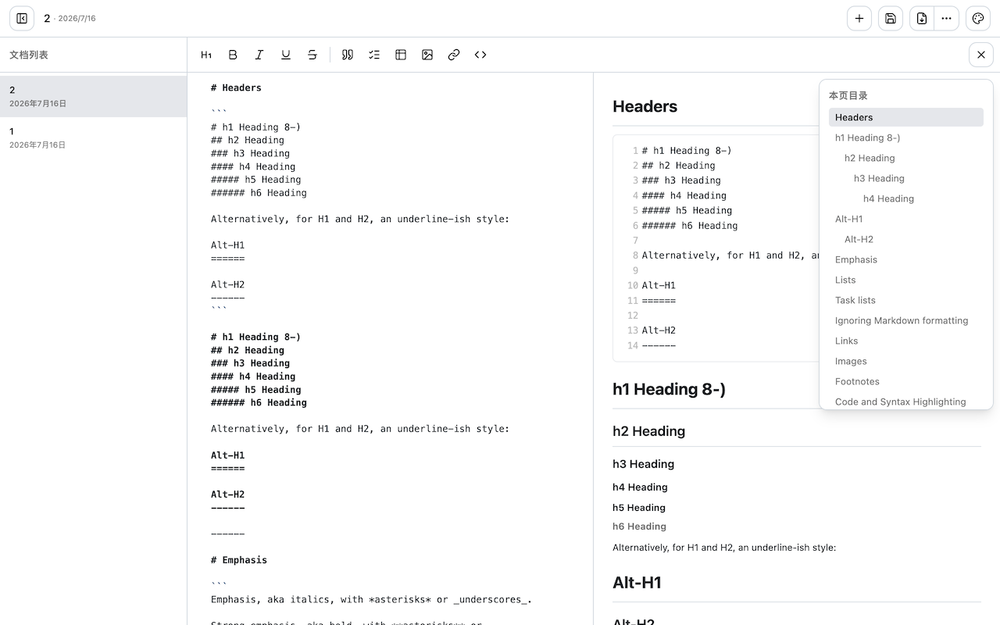
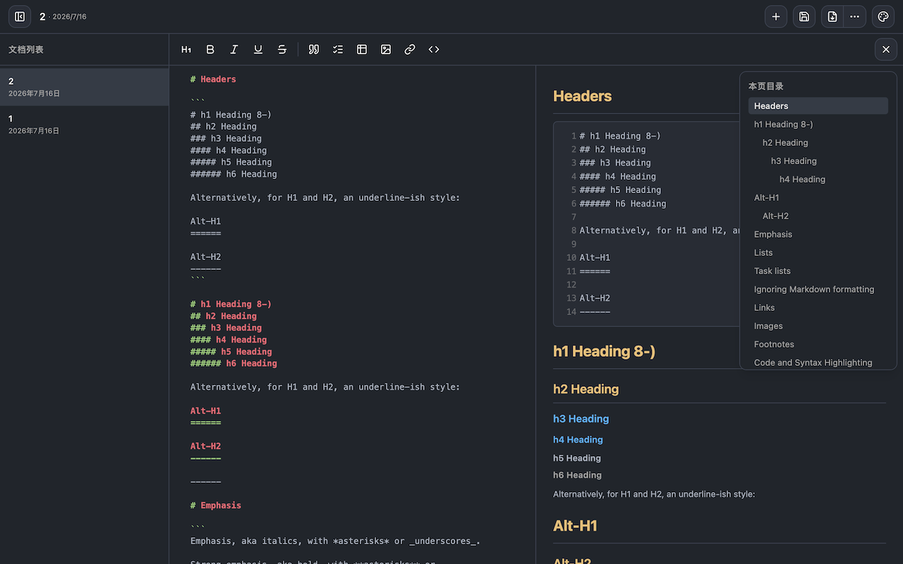
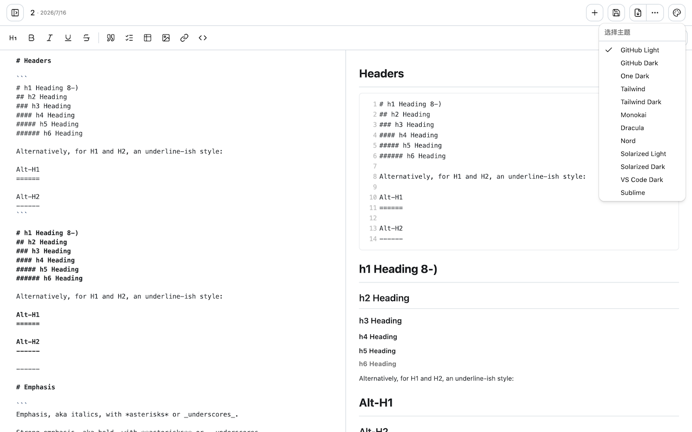
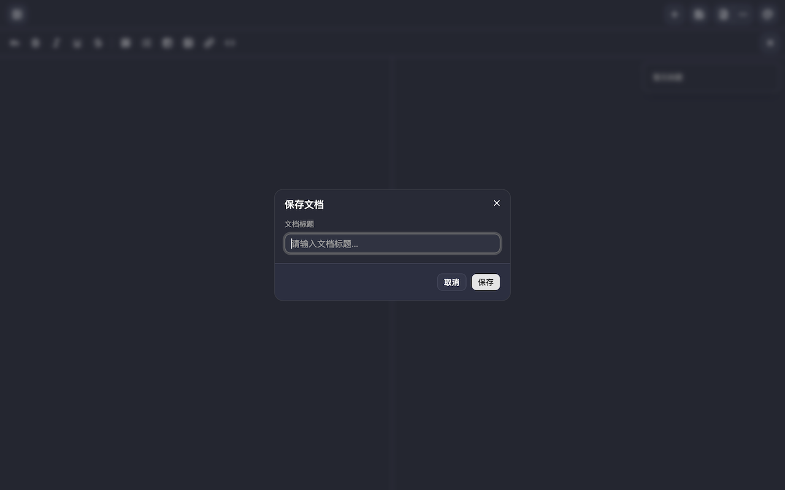

# MD Editor - Chrome 扩展

一个简洁实用的 Markdown 编辑器 Chrome 扩展，支持分屏编辑预览、Mermaid 图表、多主题切换、远程文档加载和本地文档管理。

<p align="center">
  
</p>

<table align="center">
  <tr>
    <td align="center"></td>
    <td align="center"></td>
  </tr>
  <tr>
    <td align="center"></td>
    <td align="center"></td>
  </tr>
</table>

## 安装

### Chrome Web Store

<a href="https://chromewebstore.google.com/detail/md-editor/fglfkepmpfamlbogmhhbacghhbanakfi?authuser=0&hl=zh-CN" target="_blank">
  
</a>

### 手动安装（开发模式）

1. 下载 GitHub Release 页面的最新版本到本地并解压，链接：https://github.com/wood3n/md-editor-extension/releases
2. 打开 Chrome 扩展程序管理页面并启动右上角开发者模式
3. 点击 Chrome 扩展程序管理页面左上角【加载未打包的扩展程序】选择刚才解压的文件目录即可

## 功能特性

- **Markdown + 预览分屏**：左侧 CodeMirror 6 编辑器（支持语法高亮和自动补全），右侧 markdown-it + shiki 实时渲染
- **统一主题系统**：12 套预设主题（GitHub Light/Dark、One Dark、Tailwind、Monokai、Dracula、Nord、Solarized 等），一键切换编辑器、预览区和代码高亮
- **Markdown 语法工具栏**：标题、加粗、斜体、下划线、删除线、引用、任务列表、表格、图片、链接、代码块等快捷插入按钮
- **代码高亮**：基于 shiki，支持行号显示
- **远程 Markdown 加载**：直接在浏览器中打开 `.md` 链接，扩展自动读取页面内容并加载到编辑器
- **智能缓存**：双层缓存（内存 + `chrome.storage.local`）
- **本地文档管理**：保存编辑的文档到本地，支持自定义标题，侧边栏管理文档列表
- **Mermaid 图表**：原生渲染 `mermaid` 代码块，支持流程图、时序图、甘特图等
- **导出**：下载为 Markdown（`.md`）或 HTML
- **目录导航**：自动从文档标题生成目录，悬浮在编辑器右上角
- **滚动跟随**：编辑区和预览区双向滚动同步
- **快捷键**：`⌘S` / `Ctrl+S` 快速保存

### 🎨 一键主题切换

内置 **12 套精心设计的主题预设**，点击右上角调色板按钮即可切换。每套主题会同步应用到顶部导航栏、编辑区、预览区、侧边栏和代码高亮，提供沉浸式写作体验。

| 主题            | 风格 | 预览             | 代码            | 编辑器       |
| --------------- | ---- | ---------------- | --------------- | ------------ |
| GitHub Light    | 浅色 | GitHub 风格排版  | GitHub Light    | GitHub Light |
| GitHub Dark     | 深色 | GitHub Dark 风格 | GitHub Dark     | GitHub Dark  |
| One Dark        | 深色 | Atom One Dark    | One Dark Pro    | One Dark     |
| Tailwind        | 浅色 | Tailwind 风格    | GitHub Light    | Light        |
| Tailwind Dark   | 深色 | Tailwind 暗色    | Houston         | GitHub Dark  |
| Monokai         | 深色 | One Dark         | Monokai         | Monokai      |
| Dracula         | 深色 | GitHub Dark      | Dracula         | Dracula      |
| Nord            | 深色 | One Dark         | Nord            | Nord         |
| Solarized Light | 浅色 | GitHub Light     | Solarized Light | Light        |
| Solarized Dark  | 深色 | GitHub Dark      | Solarized Dark  | GitHub Dark  |
| VS Code Dark    | 深色 | GitHub Dark      | GitHub Dark     | VS Code Dark |
| Sublime         | 深色 | One Dark         | GitHub Dark     | Sublime      |

### 🌐 远程文档直接编辑

在浏览器中打开任意 `.md`、`.markdown` 等 Markdown 文件的链接，点击扩展图标即可**一键加载到编辑器**，无需手动复制粘贴。支持 GitHub、GitLab、Gitee 等代码托管平台上的原始 Markdown 文件，也支持任意返回纯文本 Markdown 的 URL。

- 自动识别 `.md` / `.markdown` / `.mdown` / `.mkd` / `.mdx` 等 Markdown 文件扩展名
- 智能缓存机制，重复打开同一文件无需重新请求
- 加载的文档可编辑后保存到本地，随时离线查看

## 使用方法

### 打开 markdown 文件

1. 在浏览器中打开任意 `.md` 链接（如 `https://raw.githubusercontent.com/user/repo/main/README.md`）
2. 点击浏览器工具栏中的 MD Editor 扩展图标
3. 扩展自动读取页面文本内容并加载到编辑器

### 编辑和保存

1. 在编辑器中对内容进行编辑
2. 点击 **保存** 按钮（或按 `⌘S` / `Ctrl+S`）
3. 输入文档标题
4. 已保存的文档会出现在左侧侧边栏中，方便快速访问

### 侧边栏

- 点击左上角按钮切换侧边栏
- 点击任意文档加载到编辑器
- 鼠标悬停时显示删除按钮

### 导出

- 点击 **下载** 按钮下载 `.md` 文件
- 点击 **⋯** → **导出 HTML** 导出为 HTML

### 主题切换

- 点击右上角 **🎨** 调色板按钮打开主题菜单
- 12 套预设主题，一键切换整体配色

## 开发

```bash
pnpm dev    # Vite 开发服务器，支持 HMR
pnpm build  # 生产构建
```

### 技术栈

- **运行环境**：Chrome 扩展（Manifest V3）
- **前端框架**：React 18 + TypeScript
- **编辑器**：CodeMirror 6（`@codemirror/lang-markdown`）
- **Markdown 渲染**：markdown-it + `@shikijs/markdown-it`
- **代码高亮**：shiki（纯 JS 引擎，CSP 安全）
- **UI 组件**：shadcn/ui（基于 base-ui）
- **图表**：Mermaid
- **构建工具**：Vite + @crxjs/vite-plugin
- **样式**：Tailwind CSS v4
- **图标**：Lucide React

## 项目结构

```
src/
├── background/          # Service worker（扩展图标点击处理）
├── components/ui/       # shadcn/ui 组件库
├── hooks/               # React Hooks
├── newtab/
│   ├── components/      # React 组件
│   │   ├── MarkdownEditor.tsx    # 分屏编辑器主组件
│   │   ├── MarkdownToolbar.tsx   # Markdown 语法工具栏
│   │   ├── MarkdownPreview.tsx   # 渲染预览区
│   │   ├── Toolbar.tsx           # 顶部工具栏
│   │   ├── Sidebar.tsx           # 已保存文档侧边栏
│   │   ├── Toc.tsx               # 目录
│   │   ├── SaveDialog.tsx        # 保存弹窗
│   │   └── RenameDialog.tsx      # 重命名弹窗
│   ├── hooks/           # React Hooks
│   ├── lib/             # 工具库
│   │   ├── markdown.ts          # markdown-it + shiki 渲染器
│   │   ├── themes.ts            # 主题预设配置
│   │   ├── cache.ts            # 获取缓存（内存 + storage）
│   │   ├── doc-store.ts        # 文档持久化
│   │   ├── detect-markdown.ts
│   │   ├── constants.ts
│   │   └── utils.ts
│   ├── App.tsx
│   └── main.tsx
├── styles/
│   └── globals.css
└── ...
```

## 许可证

MIT
